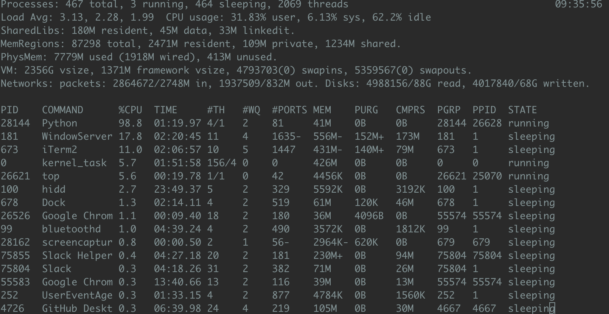
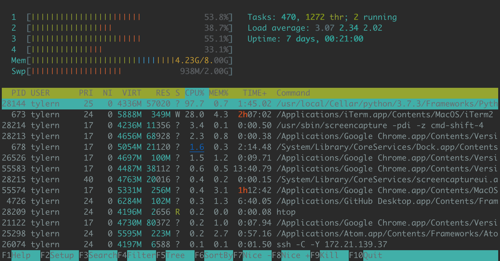

# Day 1 (The Basics)

## Installation/Python intro

## Programming Basic Terms:

- Variable
- List
- Dictionary
- Class
- Comprehension
- ...

## Unix Commands

These tutorials are based on using `bash/zsh/sh` as the shell. Most will work with different shells like `csh/tcsh` but your millage may vary. You can check the shell you are using by opening a terminal and running `echo $0`.

#### Important Information

| Keys and Unix Definitions   | Description                                     |
| -----------                 | -----------                                     |
|<kbd>CTRL</kbd>+<kbd>C</kbd> | Kills the running program, use if the program is running too long, outputting too much text to the screen, or running into errors. |
|<kbd>TAB</kbd>               | Using the TAB key, especially when navigating the filesystem, can help. Just start typing the beginning of the folder, file or program that you want to use, then hit the TAB key, the computer will try to guess what you are doing and fill in the rest. If the computer doesn't know what you want hitting the TAB key multiple times often gives you more options to choose from. |
| `.`                         | Current directory                               |
| `..`                        | Directory one up in the structure               |
| `~`                         | `$HOME` directoy, on linux `/home/<username>`, on mac `/Users/<username>` |

#### Basic file system operations

| Command               |  Description                                          |
| -----------           | -----------                                           |
| `ls`                  | list files in a directory                             |
| `cd <folder_name>`    | change directory into folder_name                     |
| `cd ..`               | move up one folder in directory structure             |
| `cd` or `cd ~`  | change directory into the `$HOME` folder of the user  |
| `pwd`                 | Prints the working directory                          |
| `mkdir <directoy>`    |  Make a new directory                                 |
| `rm <file_name>`      | *** WARNING *** Removes file. They will be gone forever. They are not stored in a trash/recycle bin. |
| `rm -r <folder_name>` | *** WARNING *** Removes folder. They will be gone forever. They are not stored in a trash/recycle bin. |
| `echo <variable>`     | Prints the variable to the screen                     |
| `touch`               | "touches" A file either updating it's modification date or creating it if it's not there. |

#### Finding things
| Command               |  Description  | Examples    |
| -----------           | -----------   | ----------- |
|  `find <path> <options> <pattern> <functions>` | Finds files in the path and can also execute functions on each file. | Find all .csv files that are less and 100kb and delete:   `find . -name '*.csv' -size -100kb -delete`|
|  `grep <pattern> <file>` or `cat file \| grep <pattern>` | Searches through a file to find a sting. | Find "error" in a logfile: `grep "error" file.log`|

#### Downloading Files
| Command               |  Description                                          |
| -----------           | -----------                                           |
| `scp <username>@<hostname_ipaddress>:</path/to/file/download.tar.gz> <destination>` | Copy files from one computer to another over ssh |
| `wget <url_to_download>` | Downloads files from the internet |
| `curl <url_to_download>` | Downloads files from the internet |

#### Putting operations together
| Command               |  Description |  Examples |
| :-----------          | :----------- | :-----------    |
| `>`                   | <b>Redirection operator</b> Takes the output of one program and redirects to another program or file.| Takes just the first 100 lines from file and copied them to shorter_file: `head -n100 file.csv > shorter_file.csv` Save output of a program to a log file instead or printing: `./myProgram > myProgram.log`|
| `\|`                  | <b>Pipe operator</b> Streams the output of one program to another program| Find all the unique values in a file: `cat file.txt \| sort \| uniq` Find the word "error" in your programs log:  `./myProgram \| grep "error"` |
| `<`                   | <b>Redirection operator</b> Takes a file and redirects to the input of a program.| `./myProgram < config.txt`|
| `;`                   | <b>Command separator</b>  Separates between commands running one after another.| `./myProgram > myProgram.log; grep "error" myProgram.log` |
| `&&`                  | <b>Logical And</b> Can also be used to separates between commands running one after another except only if the first command runs properly.  | `./task1 && ./task2` |

#### Monitoring your system
| Command               |  Description                                          | Examples                        |
| -----------           | -----------                                           | -----------                     |
| `top`                 | See what processes are running, cpu and memory usage. |  |
| `htop`                | A better version of top. Not standard on all computers (`sudo apt install htop`) (`brew install htop`)||
| `df`                  | <b>Disk Free</b> See how much of a disk is free.   | See how much disk space is free on the current disk. `df -h .` |
| `du`                  | <b>Disk usage</b> See how much disk a single file or folder is taking up.| See how much disk space all the csv files in a directory are taking up. `du -h *.csv` |

#### Environment Variables

| Command                         |  Description                                |
| -----------                     | -----------                                 |
| `.bashrc`/`.zshrc`/ `.cshrc`/`.login`     | These files are loaded when you open a shell setting up environment variables and command line functions and aliases.  |
| `export` `setenv`             | Used to set environment variables, usually in your rc file. |
| `$PATH`                          | The places, in order, that your computer will look for programs run from the shell. |
| `$PYTHONPATH`                    | The places, in order, that python will look for python libraries run from the shell. |
| `$LD_LIBRARY_PATH` `$DYLD_LIBRARY_PATH` | The places, in order, that all programs will look for libraries (Eg. `*.so/*.dyld` files) run from the shell. |

## Git/Github

All the instructions will use GitHub as the online repository but there are a few different options for hosting your git projects on the web. Other popular git websites are gitlab and bitbucket. All the instructions work the same no matter where your git repository is hosted.

#### Basic git terms (https://help.github.com/en/articles/github-glossary)
| Term                            |  Description                                |
| -----------                     | -----------                                 |
| repository | A repository is the most basic element of GitHub. They're easiest to imagine as a project's folder. A repository contains all of the project files (including documentation), and stores each file's revision history. Repositories can have multiple collaborators and can be either public or private. |
| branch | A branch is a parallel version of a repository. It is contained within the repository, but does not affect the primary or `master` branch allowing you to work freely without disrupting the "live" version. When you've made the changes you want to make, you can merge your branch back into the `master` branch to publish your changes. |
| push | Pushing refers to sending your committed changes to a remote repository, such as a repository hosted on GitHub. For instance, if you change something locally, you'd want to then push those changes so that others may access them. |
| pull | Pull refers to when you are fetching in changes and merging them. For instance, if someone has edited the remote file you're both working on, you'll want to pull in those changes to your local copy so that it's up to date. |
| commit | A commit, or "revision", is an individual change to a file (or set of files). It's like when you save a file, except with Git, every time you save it creates a unique ID (a.k.a. the "SHA" or "hash") that allows you to keep record of what changes were made when and by who. Commits usually contain a commit message which is a brief description of what changes were made. |
| clone | A clone is a copy of a repository that lives on your computer instead of on a website's server somewhere, or the act of making that copy. With your clone you can edit the files in your preferred editor and use Git to keep track of your changes without having to be online. It is, however, connected to the remote version so that changes can be synced between the two. You can push your local changes to the remote to keep them synced when you're online. |
| fork | A fork is a personal copy of another user's repository that lives on your account. Forks allow you to freely make changes to a project without affecting the original. Forks remain attached to the original, allowing you to submit a pull request to the original's author to update with your changes. You can also keep your fork up to date by pulling in updates from the original. |
| pull request | Pull requests are proposed changes to a repository submitted by a user and accepted or rejected by a repository's collaborators. Like issues, pull requests each have their own discussion forum. |

#### Basic git workflow:
1) Start by deciding what you want to work on. If you want to start your own project go to GitHub and create a repository. If you want to work on code written by another person, find the code on GitHub and <b>fork</b> it to make a copy for yourself.

2) Now <b>clone</b> that repository onto your own computer to start working (`git clone git@github.com:<username>/<repository>.git`). It's recommended to clone with ssh to avoid using your username and password to push/pull to GitHub. You can add ssh keys using these [steps](https://help.github.com/en/enterprise/2.15/user/articles/adding-a-new-ssh-key-to-your-github-account).

3) Work on your code in the newly cloned folder using your favorite editor.

4) Check what git has seen you modify by using: `git status` 

5) See what you have changed in the file from the previous version: `git diff file.py` 

6) Add the files so that git will track them: `git add file.py` You can see that is was added by checking the status again. 

7) Now add the changes. `git commit -m "Some message describing what you added or modified."`  These are still just on your own local git copy and are not yet saved to GitHub.

8) Add the changes to the online GitHub repository: `git push` 

9) If you're working from a <b>fork</b> of another repository you can then go online and make a pull request to have your changes added.
